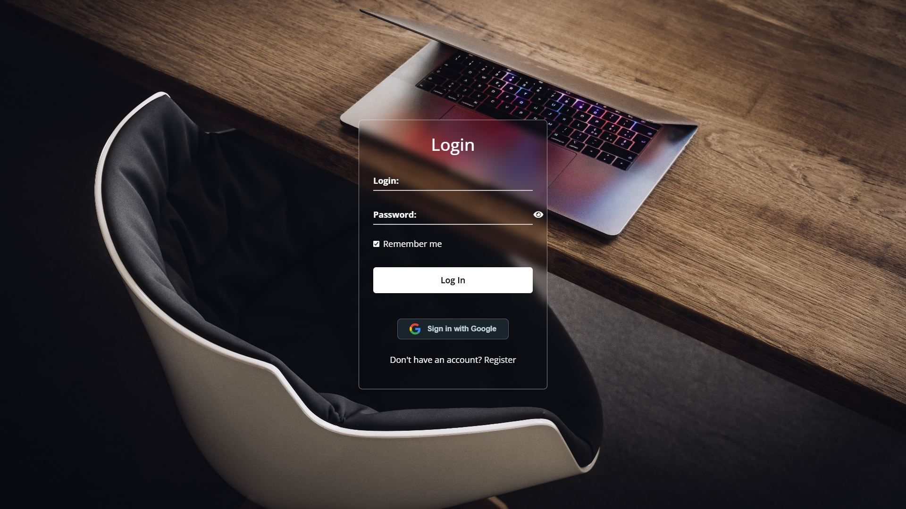
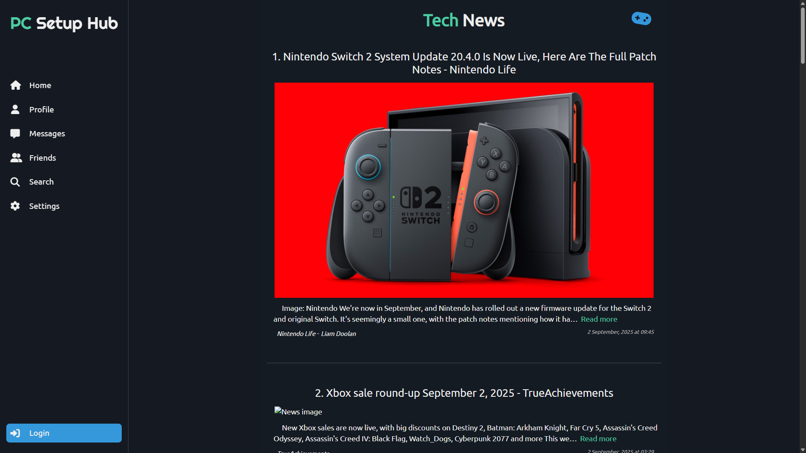
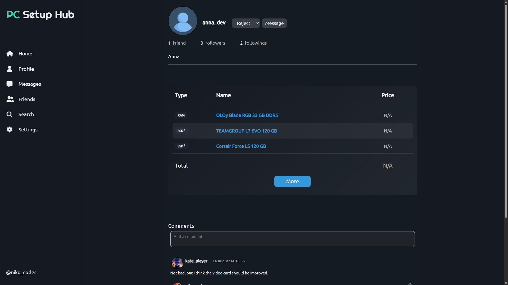
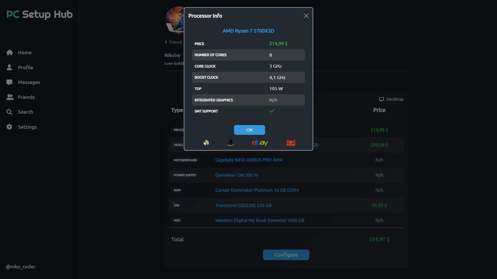
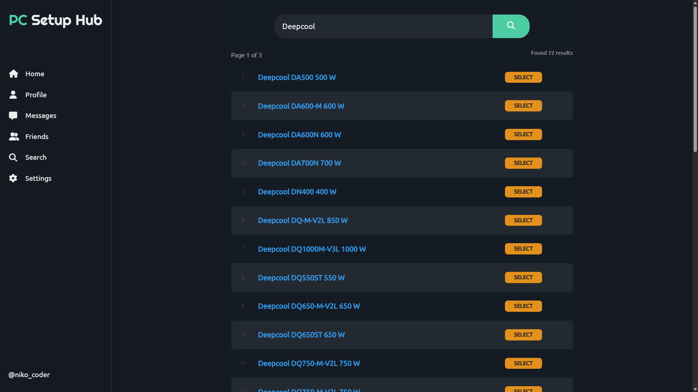
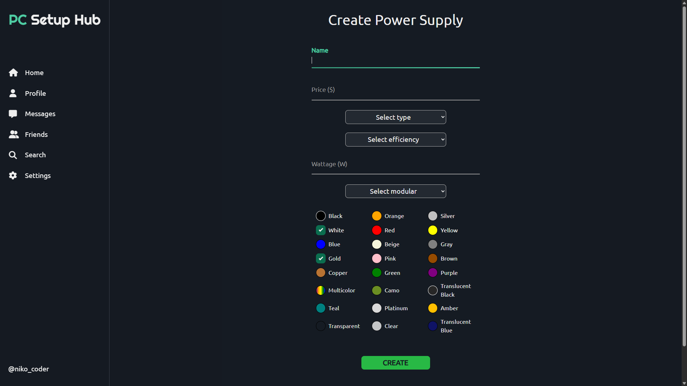
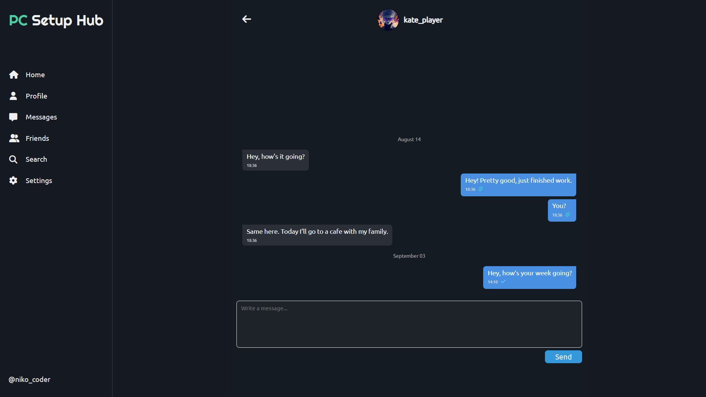

# Description
The **PC Setup Hub** project is a web application developed using **ASP .NET Core MVC**. The platform enables users to manage personal PC configurations, connect with other users and stay informed about relevant news and discussions.

**Key features include:**

- **User Authentication and Security:**  
  - Registration and login using **JWT tokens** (access & refresh).  
  - OAuth login via **Google**.  

- **User Profiles and Interactions:**  
  - Personal user profile with avatar management (images stored in **Amazon S3**).  
  - Subscriptions, followers, friends system.  
  - Private messaging through **SignalR** (real-time WebSockets).  
  - Commenting system for user profiles.  

- **PC Configuration Management:**  
  - Users can maintain a personal PC setup with processor, video card, motherboard, power supply, RAM, SSD and HDD.  
  - Multiple RAM, SSD and HDD components are supported.
  - Some components can have color or color combinations.  
  - Information about components is structured and searchable.  

- **Content and News:**  
  - Integration with **NewsAPI** to display relevant tech news.  
  - Cached in **Redis (Azure)** to reduce repeated requests and improve performance.  

- **Interactive Mini-Game (Assignment Algorithm Demo):**  
  - Users can experiment with pairing processors and video cards in a mini-game.  
  - The system uses an **assignment algorithm** to calculate optimal pairings based on performance and price-quality scores.  
  - This demonstrates real-time computation and decision-making, simulating high-demand scenarios.  

This project demonstrates the combination of modern web technologies, real-time communication and algorithmic approaches to create an interactive and informative platform for PC enthusiasts.

# Technology Stack
The project is developed in the C# programming language using ASP.NET Core MVC to create a modern and responsive web interface.
It is built on .NET 9.0, taking advantage of the latest platform features and performance improvements.

The following NuGet packages were integrated during the development process:

## AWS / Cloud Services
- **AWSSDK.Extensions.NETCore.Setup 4.0.2.2** — helps configure AWS services in .NET Core applications.  
- **AWSSDK.S3 4.0.6.13** — enables interaction with Amazon S3 for storing and retrieving files.

## HTML / Parsing
- **HtmlAgilityPack 1.12.2** — for parsing and manipulating HTML documents.

## Real-time Communication
- **Microsoft.AspNetCore.SignalR.Common 9.0.8** — provides core components for building real-time web applications with SignalR.

## Entity Framework / Database
- **Microsoft.EntityFrameworkCore 9.0.8** — main ORM library for interacting with databases using C#.  
- **Microsoft.EntityFrameworkCore.Design 9.0.8** — tools for EF Core design-time operations like migrations.  
- **Microsoft.EntityFrameworkCore.SqlServer 9.0.8** — EF Core provider for SQL Server.  
- **Microsoft.EntityFrameworkCore.Tools 9.0.8** — additional EF Core CLI tools for migrations and scaffolding.  
- **Microsoft.AspNetCore.Diagnostics.EntityFrameworkCore 9.0.8** — integrates EF Core error diagnostics into ASP.NET Core applications.

## Caching
- **Microsoft.Extensions.Caching.StackExchangeRedis 9.0.8** — provides Redis-based caching for better performance.

## Logging (Serilog)
- **Serilog.AspNetCore 9.0.0** — integrates Serilog logging into ASP.NET Core applications.  
- **Serilog.Sinks.Async 2.1.0** — enables asynchronous logging to improve performance.  
- **Serilog.Sinks.Console 6.0.0** — logs output to the console.  
- **Serilog.Sinks.File 7.0.0** — logs output to files.

## API Documentation
- **Swashbuckle.AspNetCore 9.0.4** — generates Swagger/OpenAPI documentation for APIs.

## Azure
- **Azure.Identity 1.15.0** — provides authentication support for Azure services.  
- **Azure.Security.KeyVault.Secrets 4.8.0** — allows secure access to secrets stored in Azure Key Vault.

## Authentication
- **Microsoft.AspNetCore.Authentication.Google 9.0.8** — enables Google OAuth login.  
- **Microsoft.AspNetCore.Authentication.JwtBearer 9.0.8** — enables JWT-based authentication.  
- **Microsoft.AspNetCore.Identity 2.3.1** — provides identity and user management features.

## CSV Handling
- **CsvHelper 33.1.0** — simplifies reading and writing CSV files.

## Testing
- **coverlet.collector 6.0.4** — collects code coverage data for tests.  
- **Microsoft.NET.Test.Sdk 17.14.1** — provides the test SDK for running unit tests.  
- **Moq 4.20.72** — allows creating mock objects for unit testing.  
- **xunit 2.9.3** — unit testing framework.  
- **xunit.runner.visualstudio 3.1.4** — enables running xUnit tests inside Visual Studio.

# Installing and running the project

## Clone the repository
1. Open **Visual Studio**.
2. In the Start window, select **"Clone repository"**.
3. In the **"Repository location"** dialog, paste the following link:
   ```bash
   https://github.com/SaigoTora/PCSetupHub.git
   ```
4. Select the path where the project will be cloned on your computer.
5. Click the **"Clone"** button.

## Installing dependencies
The project uses several NuGet packages. To install them:
1. Right-click the solution in **Solution Explorer**.
2. In the context menu, select **"Restore NuGet Packages"**. Visual Studio will automatically install all the necessary packages.

## Building and running the project
1. Press **Ctrl + Shift + B** to build the project.
2. Press **F5** to run the project in debug mode, or select **"Run without debugging"** (**Ctrl + F5**) for a normal run.

## Additional Setup Requirements

Before running the project, the following cloud and API configurations are required:

### 1. Amazon AWS S3
- Install **AWS Toolkit for Visual Studio**: [https://aws.amazon.com/visualstudio/?nc1=h_ls](https://aws.amazon.com/visualstudio/?nc1=h_ls).  
- Sign in to your AWS account. For guidance, you can follow this tutorial: [YouTube: AWS Toolkit Login](https://www.youtube.com/watch?v=uvJEpvDkuNc).  
- Create an **S3 bucket** with the name: `pcsetuphub-user-images`.  
  - This bucket will be used to store user avatars and other images.

### 2. Azure Account
- You need to log in to your Azure account to enable Key Vault and other Azure services.  
- Typically, you can log in using the Azure CLI command:
  ```bash
  az login
  ```
- Ensure your account has permission to create and manage resources like **Key Vault**.

### 3. Azure Key Vault
- Create a Key Vault in Azure with the name: `azure-pc-setup-hub`.  
- Add the following secrets with their corresponding values:

  - `Auth--AccessToken--SecretKey` — secret key for JWT **access token**.  
  - `Auth--RefreshToken--SecretKey` — secret key for JWT **refresh token**.  
  - `ConnectionStrings--DefaultConnection` — connection string to your database.  
  - `ConnectionStrings--RedisConnection` — connection string to your Redis instance in Azure.  
  - `GoogleClientId` — obtained by creating credentials in the [Google Cloud API Library](https://console.cloud.google.com/apis/library). For guidance, see this tutorial starting at 6:40: [YouTube Link](https://youtu.be/gq1zNiKWCP4?t=400).  
  - `GoogleClientSecret` — obtained together with `GoogleClientId` in Google Cloud.  
  - `NewsApiKey` — you can obtain one from [https://newsapi.org/](https://newsapi.org/).

- Ensure your application has permissions to read these secrets at runtime.

# Instructions for Use

The **PC Setup Hub** project is a web application where users can manage personal PC configurations, interact with other users and stay updated with relevant tech news.  

You can also modify certain settings in the `appsettings.json` file, such as Azure Key Vault, AWS S3 bucket and authentication parameters.

## User Authentication

Upon visiting the site, users can either **register a new account** or **log in** using:  
- Login and password (JWT-based authentication)  
- Google OAuth login  

After registration or login, users are redirected to the **Home page**.

## Main Features

In the application, users can:

- **Manage their profile**: update personal information, change avatar and configure settings.  
- **Interact with other users**: follow, comment on profiles and send private messages via **SignalR**.  
- **Manage PC configurations**: users can view, select, create, edit and delete components such as processors, video cards, motherboards, power supplies, RAM, SSDs and HDDs.  
  - Multiple RAM, SSD and HDD components are supported.  
  - Some components can have color or color combinations.  
- **View tech news**: news fetched from **NewsAPI** and cached in Redis for performance.  
- **Play the Mini-Game**: experiment with processor and video card pairings. The system calculates optimal assignments using the **assignment algorithm**, demonstrating real-time computation.

## Screenshots
Below are some screenshots demonstrating the key interfaces of the **PC Setup Hub** project.

**Login / Registration Page**



**Home Dashboard**



**User Profile Overview**



**Component Details**



**Component Search Interface**



**Create / Edit Component Page**



**Chat Dialog**


